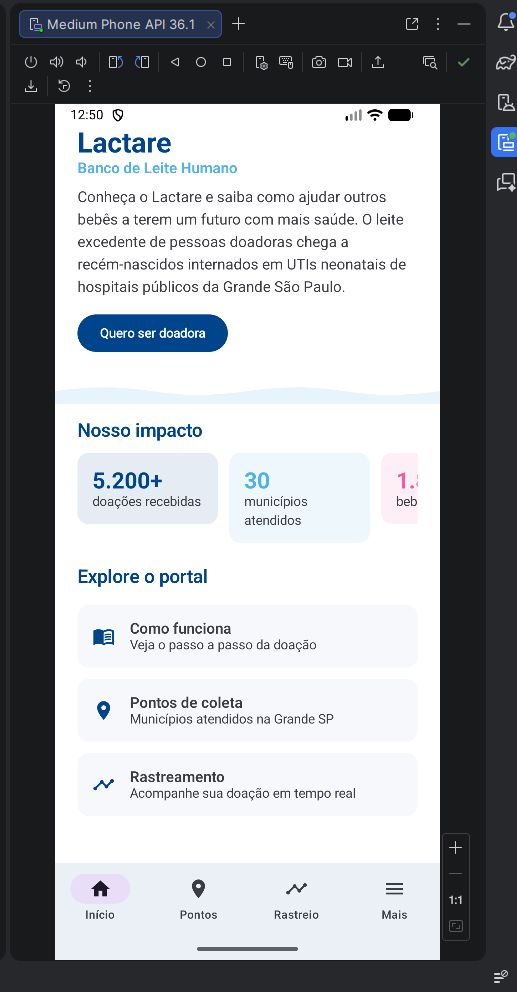
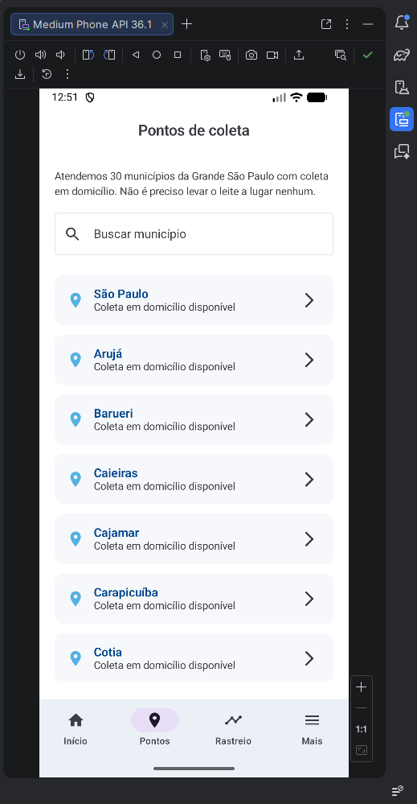
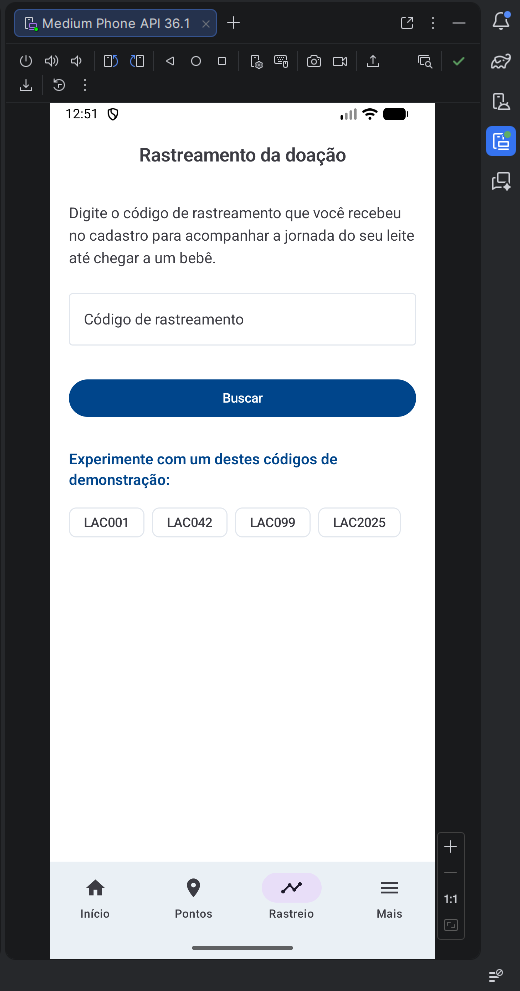
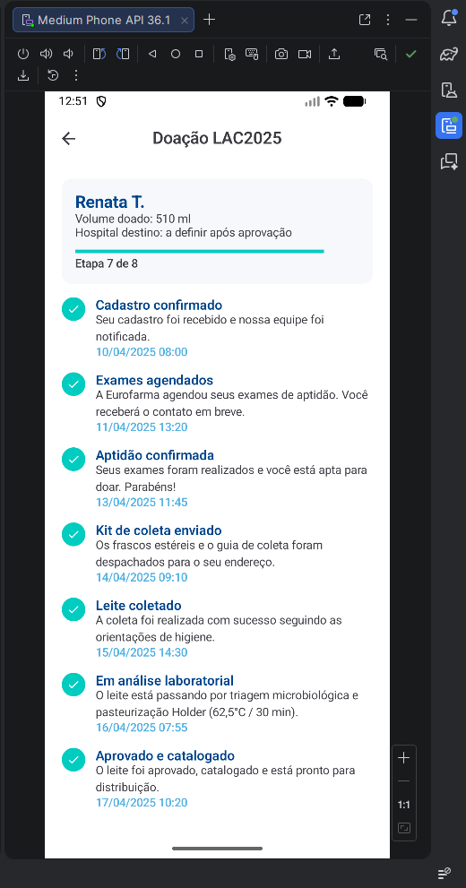
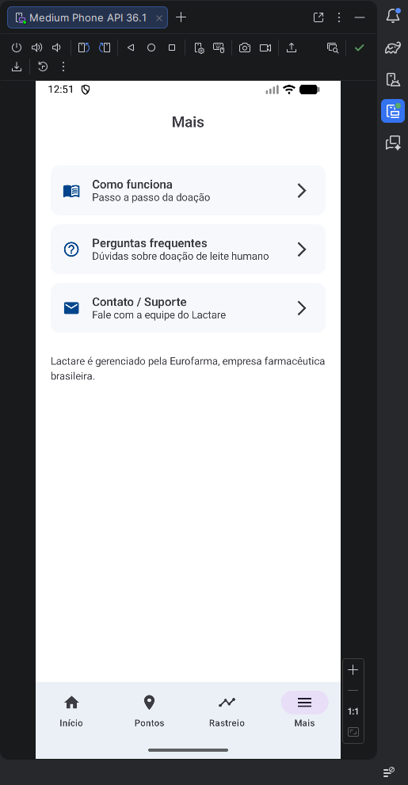
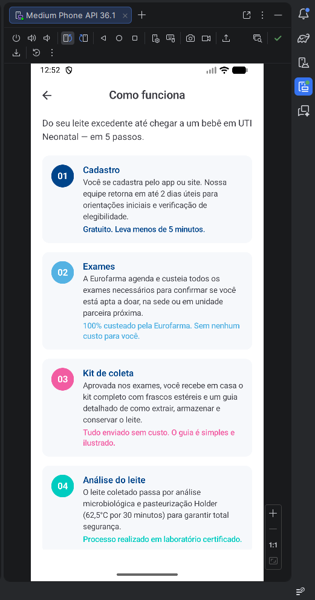
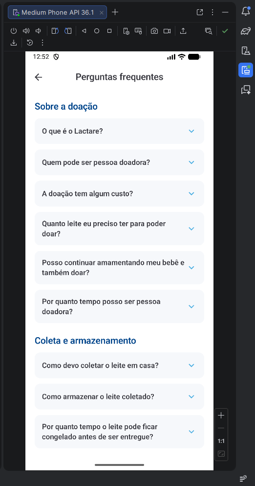
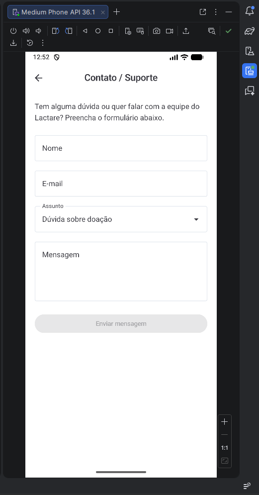

# Lactare — App Android (MVP Sprint 3)

> Projeto desenvolvido para a disciplina **Android com Kotlin** — FIAP, Turma 3SIR
> Challenge FIAP 2026 — Cliente: **Eurofarma** | Produto: **Lactare — Banco de Leite Humano**

Este app é a versão Android nativa (Kotlin + Jetpack Compose) do **Portal da Nutriz**,
espelhando a proposta apresentada no pitch (protótipo web em React). Nesta Sprint não há
integração com API, Firebase ou banco de dados — todos os dados são **mockados**.

---

## Equipe

| Nome completo | RM |
|---|---|
| Rafael Catapani Scharlack | 554633 |
| Gustavo Iudi Rosa Oda | 556754 |
| Maria Eduarda de Araujo Fernandes | 554593 |
| Felipe Maringoli Teixeira | 556100 |

**Link do repositório GitHub:** [github.com/Rafael-Scharlack/lactare-app](https://github.com/Rafael-Scharlack/lactare-app)

---

## Sobre o projeto

O **Lactare** é o primeiro banco de leite humano privado criado por uma farmacêutica no
Brasil, fundado em 2019 pela Eurofarma. Coleta leite de pessoas doadoras voluntárias e
distribui em hospitais públicos da Grande São Paulo para alimentar recém-nascidos
internados em UTIs neonatais.

**Problema:** a comunicação e o engajamento com potenciais doadoras ainda são limitados,
dificultando que mais nutrizes conheçam a iniciativa e se sintam apoiadas para participar.

**Solução (este app):** uma versão navegável do Portal da Nutriz em Android nativo, com
as 7 telas públicas do portal, dados mockados e fluxos de uso completos — cadastro de
interesse, busca de pontos de coleta e rastreamento da doação.

---

## Escopo funcional implementado

Foram priorizadas as 7 funcionalidades públicas do pitch (Portal da Nutriz), por serem o
núcleo de valor da proposta e o que mais diretamente ataca o problema de comunicação e
engajamento identificado. Ficaram fora do escopo desta Sprint o Portal Interno (admin da
Eurofarma) e o chatbot com IA, já que o enunciado não exige integração externa e o MVP
Android deve focar no fluxo do usuário final (a doadora).

| Tela | Funcionalidade |
|---|---|
| **Home** | Apresentação do Lactare, números de impacto (mockados) e atalhos para as demais seções |
| **Como Funciona** | 5 passos do processo de doação, com cor, descrição e detalhe de cada etapa |
| **Pontos de Coleta** | Lista com busca dos 30 municípios atendidos (Grande SP); toque abre o detalhe |
| **Detalhe do Ponto** | Informações do município + ação "Solicitar agendamento" (mock, com feedback visual) |
| **Cadastre-se como Doadora** | Formulário (nome, telefone, cidade, tempo de amamentação, leite excedente) → gera protocolo mockado |
| **Rastreamento** | Busca por código → timeline visual das 8 etapas da doação, com datas e progresso |
| **Perguntas Frequentes** | 5 categorias, 22 perguntas, em formato de acordeão expansível |
| **Contato/Suporte** | Formulário de contato com confirmação de envio |

---

## Tecnologias utilizadas

- **Kotlin** 1.9.24
- **Jetpack Compose** (Material 3) — UI 100% declarativa, sem XML de layout
- **Navigation Compose** 2.7.7 — navegação entre todas as telas, com passagem de parâmetros
- **Android Gradle Plugin** 8.5.2
- compileSdk 35 · minSdk 26 · targetSdk 35

---

## Dados mockados

Todos os dados estão organizados em classes de modelo (`model/`) e objetos de dados
(`mock/`), nunca espalhados diretamente nas telas:

- **`PontosMock`** — 30 municípios da Grande São Paulo atendidos pelo Lactare (nome + coordenadas)
- **`ComoFuncionaMock`** — os 5 passos do processo de doação
- **`EtapasMock`** — as 8 etapas fixas da jornada de uma doação
- **`DoacoesMock`** — 4 doações de exemplo, localizáveis por código (`LAC001`, `LAC042`, `LAC099`, `LAC2025`), cada uma em uma etapa diferente da jornada
- **`FaqMock`** — 5 categorias e 22 perguntas/respostas reais sobre o processo de doação

Esses são os mesmos dados de demonstração usados no protótipo web do pitch, garantindo
coerência entre as duas entregas.

---

## Arquitetura e organização do código

```
app/src/main/java/com/lactare/app/
├── MainActivity.kt          # ponto de entrada único (Compose)
├── model/                   # data classes (PontoColeta, Doacao, EtapaDoacao, FaqPergunta...)
├── mock/                    # dados simulados, organizados por domínio
├── navigation/               
│   ├── LactareDestination.kt  # rotas centralizadas (sem strings soltas nas telas)
│   └── LactareNavGraph.kt     # NavHost + bottom bar
└── ui/
    ├── theme/                # Color.kt, Theme.kt, Type.kt (paleta oficial da marca)
    ├── components/           # TopBar, BottomBar, SectionWave, StatCard (reutilizáveis)
    └── screens/              # uma pasta por tela (home, cadastro, pontos, rastreamento, faq, contato, mais)
```

Cada tela fica isolada em seu próprio arquivo/pasta, sem lógica de outras telas
misturada, e toda navegação passa pelo grafo central em `LactareNavGraph.kt`.

---

## Navegação

- **Barra inferior** com 4 seções principais: Início, Pontos, Rastreio, Mais
- **Lista → Detalhe com parâmetro**: Pontos de Coleta → toque em um município → `pontos/{pontoId}`
- **Busca → Detalhe com parâmetro**: Rastreamento → código digitado ou chip de exemplo → `rastreamento/{codigo}`
- **Menu → Sub-telas**: "Mais" → Como Funciona / FAQ / Contato
- **Fluxo cruzado**: Cadastro concluído → botão leva direto para Rastreamento
- Toda ação tem retorno visual: Snackbar (agendamento), tela de confirmação (cadastro e contato), estado de erro inline (código não encontrado)

---

## Instruções para executar o projeto

1. Abra o Android Studio (recomendado: **Ladybug 2024.2.1** ou mais recente).
2. `File > Open` e selecione a pasta raiz deste projeto (`LactareApp/`).
3. Aguarde o Gradle Sync (o Android Studio gera o wrapper automaticamente se necessário).
4. Rode em um emulador ou dispositivo físico com **Android 8.0 (API 26) ou superior**.
5. Não é necessário configurar nenhuma variável de ambiente ou chave de API — todos os dados são mockados localmente.

---

## Evidências de funcionamento

Prints do app rodando no emulador Android Studio (Medium Phone API 36.1):

| Home | Pontos de Coleta |
|---|---|
|  |  |
| Apresentação do Lactare, números de impacto e atalhos para as demais seções | Lista dos 30 municípios atendidos, com busca |

| Rastreamento | Detalhe do Rastreamento |
|---|---|
|  |  |
| Busca por código de rastreamento, com chips de exemplo | Timeline das 8 etapas da doação `LAC2025`, com datas e progresso |

| Mais | Como Funciona |
|---|---|
|  |  |
| Menu de acesso a Como Funciona, FAQ e Contato | Os 5 passos do processo de doação |

| Perguntas Frequentes | Contato / Suporte |
|---|---|
|  |  |
| 5 categorias de perguntas em formato de acordeão | Formulário de contato com a equipe do Lactare |

Versão do Android Studio utilizada: Android Studio Panda 1 | 2025.3.1 Patch 1
Dispositivo/emulador utilizado: Medium Phone API 36.1 (emulador Android)

---

*Projeto Lactare — Challenge FIAP 2026 / Eurofarma — Sprint 3 (Android Kotlin)*
